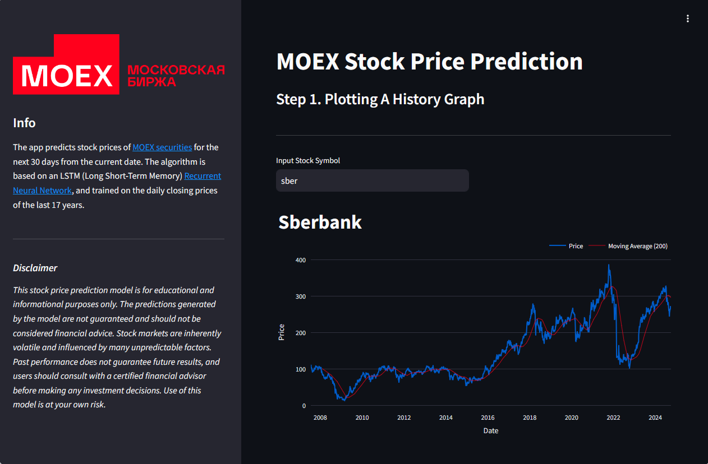
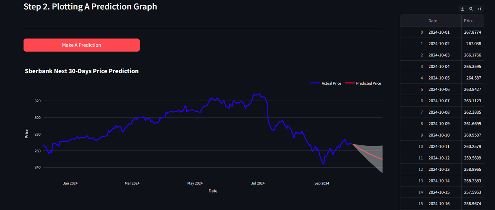

# LSTM Stock Prices Prediction Model

https://lstmstock.streamlit.app/

This project implements a model for predicting the price of MOEX stock for a time interval of 30 days from the current date. The algorithm is an LSTM model based on a recurrent neural network. The training data are the closing prices of financial assets for the last 17 years. 

The project is deployed at [Streamlit.io](https://streamlit.io/)

[**Recurrent neural networks (RNNs)**](https://en.wikipedia.org/wiki/Recurrent_neural_network) are a class of artificial neural networks for sequential data processing. One of them is LSTM (Long Short-Term Memory) network.

[**The Moscow Exchange (MOEX)**](https://www.moex.com/en) is the largest exchange in Russia, operating trading markets in equities, bonds, derivatives, the foreign exchange market, money markets, and precious metals. In the Main Market sector more than 1,400 securities from roughly 700 Russian issuers are available for trading every day.

The list of all MOEX securities can be found here: https://www.moex.com/en/moexboard/instruments-list.aspx

## Content:
- streamlit_app.py - is for streamlit deploying
- LSTM_training_model.ipynb - you can train your own model and play with parameters
- LSTM_stock_model.pkl - ready model with optimal parameters
- requirements.txt is for streamlit_app.py only
- requirements2.txt is for both streamlit_app.py file & LSTM_training_model.ipynb

## Main libraries:
- pandas
- numpy
- plotly
- seaborn
- sklearn
- json
- keras
- API MOEX

## Disclaimer
This stock price prediction model is for educational and informational purposes only. The predictions generated by the model are not guaranteed and should not be considered financial advice. Stock markets are inherently volatile and influenced by many unpredictable factors. Past performance does not guarantee future results, and users should consult with a certified financial advisor before making any investment decisions. Use of this model is at your own risk.